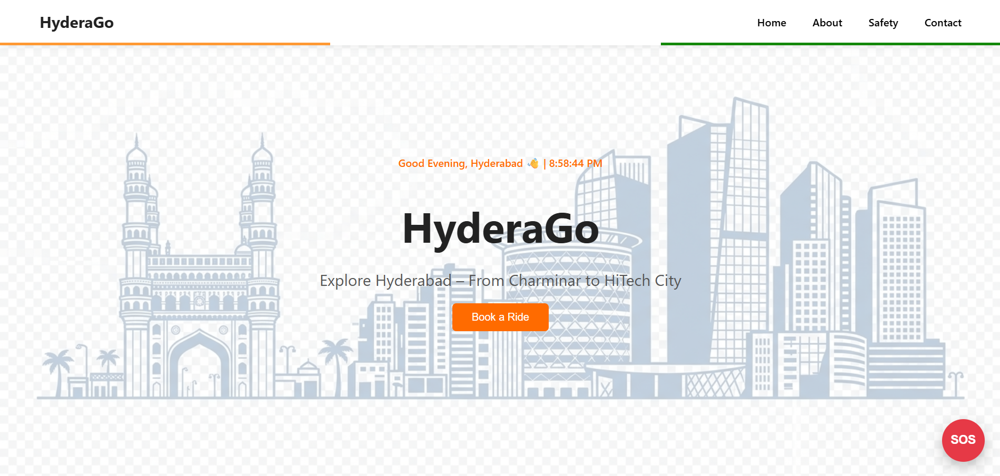
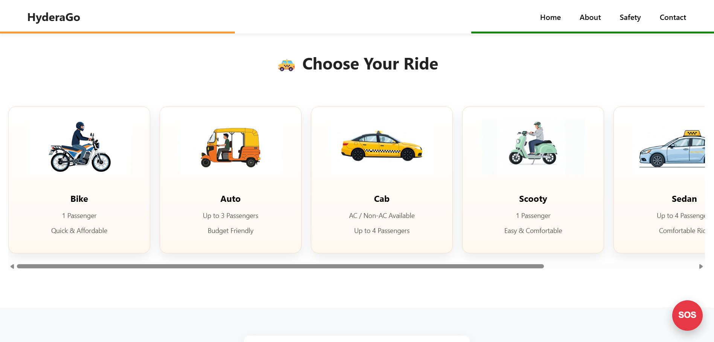
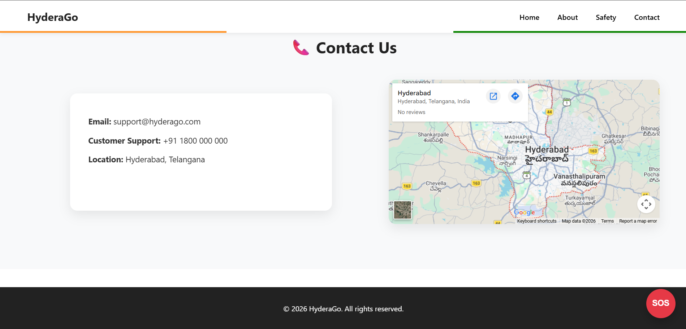

 🚖 HyderaGo – Ride Booking Web App

HyderaGo is a responsive ride booking web application inspired by modern ride-hailing platforms.  
Users can explore Hyderabad, choose rides, view famous locations, and simulate booking a ride.

🌟 Features

- Ride selection (Bike, Auto, Cab, Scooty, Sedan, SUV)
- Pickup and drop location booking
- Fare estimation
- Payment method selection
- Driver details simulation
- SOS emergency safety feature
- Hyderabad tourist highlights
- Interactive UI with smooth scrolling
- Google Maps location preview

🏙 Hyderabad Highlights

The app showcases famous places in Hyderabad:

- Charminar
- HiTech City
- Hyderabadi Biryani

Clicking each card reveals additional information about the place.

🛠 Tech Stack

- React.js
- JavaScript
- HTML5
- CSS3

 🚀 Installation

Follow the steps below to run the HyderaGo project on your local machine.

Step 1 — Clone the Repository

```bash
git clone https://github.com/yelugubanti-sunitha/hyderago.git
```

Step 2 — Go to the Project Folder

```bash
cd hyderago
```

Step 3 — Install Project Dependencies

```bash
npm install
```

Step 4 — Start the React Development Server

```bash
npm start
```

Step 5 — Open the Application in Your Browser

```bash
http://localhost:3000
```

After running `npm start`, the application will automatically start and open in your browser.

If it does not open automatically, copy the URL above and paste it in your browser.

---

## 📋 Requirements

Make sure the following software is installed on your system:

```bash
Node.js
npm
Git
```

You can download Node.js from:

```bash
https://nodejs.org
```
 📸 Screenshots

Home Page


Ride Selection


Contact Section

